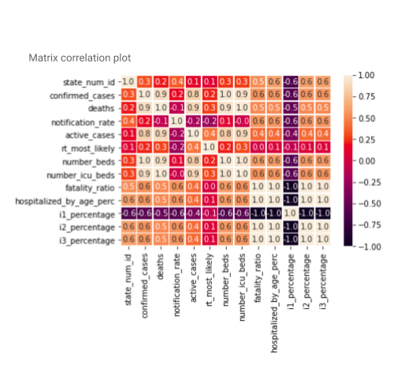

# Amanda ImpulsoGov

# Desafio ImpulsoGov | Cientista de Dados 🧪

## Questões

### Projeção subestimada

**1. (descritiva) O SimulaCovid, nosso simulador de demanda hospitalar por leitos enfermaria e UTI, está subestimando o número de internações por Covid-19 em diversos estados brasileiros. Leia com atenção o código fonte disponibilziado neste repositório e as instruções do cálculo de projeção no notebook, e responda: o que pode estar acontecendo?**

O fator que pode estar influenciando na projeção subestimada do número de internações por Covid-19 em diversos estados brasileiros pode ser o fato de que algumas variáveis selecionadas para a construção do modelo de projeção não possuem relação linear.

**2. (descritiva/implementação) Como você resolveria esse problema? Indique seu raciocínio, hipóteses, testes realizados e implemente até onde possível com base nos dados da nosssa API.**

Para entender qual fator está relacionado ao processo de subestimar o número de internações por Covid-19 em diversos estados brasileiros, eu iniciei uma análise exploratória dos dados de cada banco, em seguida interpretei os códigos a fim de entender a lógica do modelo,bem como testes as duas funções contidas no arquivo simualdor.py, ou seja, a função simulador.get_dday e simulador.run_simulation. Após estar familiarizada com a estrutura do modelo eu tentei traçar hipóteses baseadas nas observações dos dados e do código. Com isso cheguei a  seguinte hipótese: em um modelo de projeção, se a relação entre cada variável preditora e a variável de critério for não linear, então as projeçẽos podem superestimar sistematicamente os valores reais para uma faixa de valores em uma variável preditora e subestimá-los para outra. Essa hipótese pode ser confirmada através de um teste de correlação, o qual dedica-se a inferências estatísticas das medidas de associação linear que mede a “força” ou “grau” de relacionamento linear entre duas variáveis. Essa medida varia de 1 a -1, sendo os valores próximos 0 representando uma baixa correlação linear, ou seja, indicando variáveis que possuem relação não linear. Valores próximos de 1 indicam relações lineares positivas, e valores próximos a -1 indicam relações lineares negativas. Então para testar essa hipótese eu realizei um teste de correlação com os dados do banco http://datasource.coronacidades.org/br/states/parameters e do banco http://datasource.coronacidades.org/br/states/farolcovid/main. 

Para o teste de correlação foi utilizada a função .corr() e para gerar a visualização do heatmap utilizou-se biblioteca seaborn e a função seaborn.heatmap(). O script para a análise de correlação pode ser visto em ***correlation_analysis.ipynb*** O heatmap gerado pode ser visualizado abaixo, através dele podemos observar que a correlação entre as variáveis notification_rate e number_icu_beds; bem como, a correlação das variáveis rt_most_likely e fatality_ratio são iguais a 0, ou seja, essas variáveis não possuem correlação entre si. Além disso, existem variáveis que possuem uma correlação baixa entre sim. Dentre elas temos: confirmed_case com notification_rate; confirmed_case com rt_most_likely; deaths com notification_rate; deaths com rt_most_likely; active_cases com notification_rate; rt_most_likely com todas as outras variáveis; e number_beds com notification_rate. 

**Figura 1.** Matriz de correlação das variáveis do banco de dados do CoronaCidades e do FarolCovid. Valores próximos 0, representado pela tonalidade de vermelho, demonstra uma baixa correlação linear, ou seja, indica variáveis que possuem relação não linear. Valores próximos de 1, representados pela tonalidade laranja, indicam relações lineares positivas, ou seja, variáveis que possuem correlação e são diretamente proporcionais. Já valores próximos a -1, representados pela tonalidade roxa, indicam relações lineares negativas, ou seja, variáveis que são inversamente proporcionais.

Nessa situação onde diversas variáveis possuem baixa correlação ou não possuem correlação, existem duas alternativas viáveis: (1) fazer transfromações com essas variáveis e utilizar modelos de regressão lineares ou; (2) usar modelos de regressão não lineares. Nesse caso, eu testei usar um modelo de regressão não linear usando o pacote do R **nls.multstart** através da fórmula: *I1 ~ beta1 * (I2^beta2) * (I3^beta3)*. Infelizmente eu tive problemas com a leitura dos pacotes do R dentro do Python (o código da implementação de um modelo de regressão não linear está disponível no arquivo ******). No entanto 

**3. (descritiva) Quais são as vantagens e desvantagens dessa solução? (Caso tenha descrito mais de uma solução acima, escolha a mais pertinente) Existe alguma dificuldade dessa solução ser implementada no código da ferramenta?**

A solução seria usar um modelo de regressão não linear, as vantagens de se usá-lo é que enquanto as equações lineares possuem uma forma básica, as equações não-lineares podem assumir muitas formas diferentes; por isso, a regressão não-linear proporciona um ajuste de curva mais flexível, bem como as funções desse tipo de regressão podem ter mais de um parâmetro por variável preditora. Por outro lado, as principais desvantagens estão relacionadas ao fato de que, esse tipo de regressão, permite um número quase infinito de funções possíveis, isso pode gerar uma certa dificuldade de configurá-lo. Além disso, os intervalos de confiança podem ou não ser calculáveis, vai depender do modelo desenvolvido. Adicionalmente, os métodos de inferência são aproximados e requerem procedimentos iterativos de estimação baseados no fornecimento de valores iniciais para os parâmetros. 

A implementação de um modelo de regressão não linear se mostra viável, principalmente pelo fato dos autores Milhinhos & Costa (2020) **(paper disponível em arquivo andditional_material/ActiveCasesUsingNonlinearRegression.pdf)** terem descrito nesse estudo a modelagem da progressão dos casos ativos de Covid em Portugal por meio de regressão não linear. Nesse estudo, os autores optaram pela abordagem de regressão não linear justamente porque os dados do mês de Julho 2020 diferiram muito das indicações positivas do modelo anterior, o qual subestimou o número de casos ativos. No caso deste estudo, foram utilizados os parâmetros do modelo através da estimativa de mínimos quadrados usando o pacote *drc* do R. Além desse pacote, no R existem uma função e um pacote que são utilizadas nesses casos de regressão não linear: (1) a função *nls()*; e (2) o pacote *nlme*. Essas funções e pacotes do R, específicos para regressão não linear, podem ser usadas dentro do python através da biblioteca rpy2. Em vista disso, se mostra possível a integração de modelos de regressão não linear ao código já desenvolvido.
