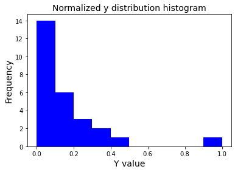
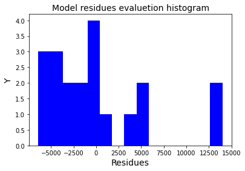
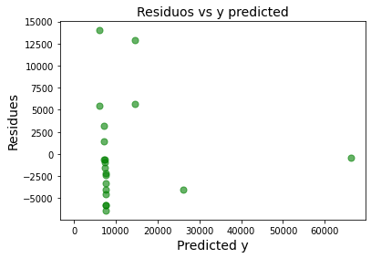
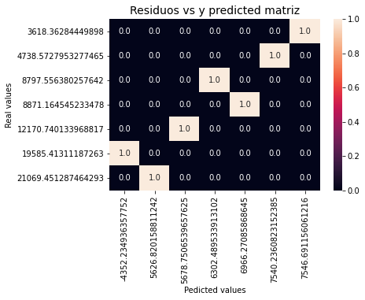
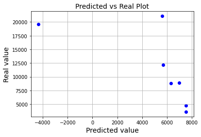

# Amanda ImpulsoGov

# Desafio ImpulsoGov | Cientista de Dados 🧪

## Questões

### Projeção subestimada

**1. (descritiva) O SimulaCovid, nosso simulador de demanda hospitalar por leitos enfermaria e UTI, está subestimando o número de internações por Covid-19 em diversos estados brasileiros. Leia com atenção o código fonte disponibilziado neste repositório e as instruções do cálculo de projeção no notebook, e responda: o que pode estar acontecendo?**

O fator que pode estar influenciando na projeção subestimada do número de internações por Covid-19 em diversos estados brasileiros pode ser o fato de que algumas variáveis selecionadas para a construção do modelo de projeção não possuem relação linear.

**2. (descritiva/implementação) Como você resolveria esse problema? Indique seu raciocínio, hipóteses, testes realizados e implemente até onde possível com base nos dados da nosssa API.**

Para entender qual fator está relacionado ao processo de subestimar o número de internações por Covid-19 em diversos estados brasileiros, eu iniciei uma análise exploratória dos dados de cada banco, em seguida interpretei os códigos a fim de entender a lógica do modelo,bem como testes as duas funções contidas no arquivo simualdor.py, ou seja, a função simulador.get_dday e simulador.run_simulation. Após estar familiarizada com a estrutura do modelo eu tentei traçar hipóteses baseadas nas observações dos dados e do código. Com isso cheguei a  seguinte hipótese: em um modelo de projeção, se a relação entre cada variável preditora e a variável de critério for não linear, então as projeçẽos podem superestimar sistematicamente os valores reais para uma faixa de valores em uma variável preditora e subestimá-los para outra. Essa hipótese pode ser confirmada através de um teste de correlação, o qual dedica-se a inferências estatísticas das medidas de associação linear que mede a “força” ou “grau” de relacionamento linear entre duas variáveis. Essa medida varia de 1 a -1, sendo os valores próximos 0 representando uma baixa correlação linear, ou seja, indicando variáveis que possuem relação não linear. Valores próximos de 1 indicam relações lineares positivas, e valores próximos a -1 indicam relações lineares negativas. Então para testar essa hipótese eu realizei um teste de correlação com os dados do banco http://datasource.coronacidades.org/br/states/parameters e do banco http://datasource.coronacidades.org/br/states/farolcovid/main. 

Para o teste de correlação foi utilizada a função .corr() e para gerar a visualização do heatmap utilizou-se biblioteca seaborn e a função seaborn.heatmap(). O script para a análise de correlação pode ser visto em ***correlation_analysis.ipynb*** O heatmap gerado pode ser visualizado abaixo, através dele podemos observar que a correlação entre as variáveis notification_rate e number_icu_beds; bem como, a correlação das variáveis rt_most_likely e fatality_ratio são iguais a 0, ou seja, essas variáveis não possuem correlação entre si. Além disso, existem variáveis que possuem uma correlação baixa entre sim. Dentre elas temos: confirmed_case com notification_rate; confirmed_case com rt_most_likely; deaths com notification_rate; deaths com rt_most_likely; active_cases com notification_rate; rt_most_likely com todas as outras variáveis; e number_beds com notification_rate. 

**Figura 1.** Matriz de correlação das variáveis do banco de dados do CoronaCidades e do FarolCovid. Valores próximos 0, representado pela tonalidade de vermelho, demonstra uma baixa correlação linear, ou seja, indica variáveis que possuem relação não linear. Valores próximos de 1, representados pela tonalidade laranja, indicam relações lineares positivas, ou seja, variáveis que possuem correlação e são diretamente proporcionais. Já valores próximos a -1, representados pela tonalidade roxa, indicam relações lineares negativas, ou seja, variáveis que são inversamente proporcionais.

<!--
	Faz parte da resposta anterior:

	Nessa situação onde diversas variáveis possuem baixa correlação ou não possuem correlação, existem duas alternativas viáveis: (1) fazer transfromações com essas variáveis e utilizar modelos de regressão lineares ou; (2) usar modelos de regressão não lineares. Nesse caso, eu testei usar um modelo de regressão não linear usando o pacote do R **nls.multstart** através da fórmula: *I1 ~ beta1 * (I2^beta2) * (I3^beta3)*. Infelizmente eu tive problemas com a leitura dos pacotes do R dentro do Python (o código da implementação de um modelo de regressão não linear está disponível no arquivo ***non_linear_model.ipynb***). Apesar disso, os testes posteriores a implementação do modelo seria análise dos ajustes com a função *summary()*, com a qual poderiamos ver quantas iterações foram necessárias, bem como os erros e valores de significância. Após essas verificações, verificaria o coeficiente de determinação através da função *sum(residuals()^2)* bem como calcular R2. Por fim, plotaria para avaliar os ajustes da equação.
-->

Apesar da hipótese ser que algumas variáveis possuem relação não linear, sendo essa situação responsável pela subestimação dos valores preditos, as variáveis utilizadas no modelo que desenvolvi neste desafio possuem relação linear. Em vista disso,  utilizou-se uma regressão linear múltipla para fazer a projeção. A escolha da regressão linear múltipla se deu pois existem mais de uma variável independente. Sendo essas:

      - I1 * beta1
	  - I2 * beta2
	  - I3 * beta3

A escolha das variáveis do modelo a ser utilizado foi baseado na descrição feita no [arquivo simulation.ipynb](https://github.com/ImpulsoGov/techdados_desafio_datasience/blob/main/simulation.ipynb) disponibilizado, no qual foi descrito que a relação (I2+I3/I1) fornece os valores esperados de hospitalizações. Considerando esse fato, as variáveis necessárias para desenvolver o modelo seriam aquelas envolvidas nos cálculos dos parâmetros beta1, beta2 e beta3, bem como as variáveis de cálculo para definir I1, I2 e I3 e, consequentemente, para cálculo do y (variável preditora/dependente). Os cálculos descritos acima foram baseados nos códigos disponibilizados no desafio. 

Após a determinação das variáveis independentes e dependente e dos respectivos cálculos, foi feita a estatística descritiva do valor de y, variável preditora/dependente, através da função describe(). Essa análise revelou que a média dos valores de y é igual a *~11728.63*; o valor mínimo é de *~1168.07*; o valor máximo é de *~65900.79*; o percentil 25% é igual a *~4480.56*; o percentil 50% é igual a *~6690.28*; e o percentil 75% é igual a *~15878.07*. Em seguida fez-se a plotagem em forma de histograma para entender a distribuição da variável y. Após essa plotagem, fez-se a normalização dos dados através da seguinte função:

*def normalize(y):
    return [(y[n] - min(y)) / (max(y) -
          min(y)) for n in range(len(y))]*

Para verificar a normalização dos dados, fez-se uma segunda plotagem com histograma. O gráfico (Figura 2) abaixo demonstra a distribuição de y após a normalização com os valores ao quadrado com a curva teórica da distribuição Y2. 

**Figura 2.** Histograma dos valores de y normalizados. No eixo x encontram-se as frequências. No eixo encontram- se os valores de y. 

Após a normalização do y, e avaliação da sua distribuição, foi feito um split nos dados através da função train_test_split() da biblioteca sklearn para separar os dados que seriam utilizados no treino do modelo, e os dados utilizados no teste. Tendo os dados de treino e teste separados, iniciou-se a construção do modelo de regressão linear múltipla. Para isso, utilizou-se a biblioteca sklearn e a função LinearRegression() da mesma. Além disso, utilizou-se a função fit() para ajustar o modelo com os dados de treino para encontrar os coeficientes para a equação. O y, variável preditora/dependete, utilizado no modelo foi:

*y = (I2+I3/I1)*

O x, variável independente, utilizado no modelo foi:

*x = [I1_inde, I2_inde, I3_inde]*

O modelo foi definido e rodado. Em seguida, iniciou-se o processo de avaliação do modelo. A primeira avaliação do modelo foi feita utilizando a função predict() a fim de comparar os valores preditos com os valores reais. Os valores podem ser vistos na tabela 1. Após a geração da tabela, esses valores foram plotados afim de melhor visualizar essa relação.

**Tabela 1.** Valores reais em comparação aos valores preditos de hospitalizações pelo modelo de regressão linear múltipla.

| **Valores reais** | **Valores Preditos** |
|-------------------|----------------------|
|      12170.740134 |          5678.750654 |
|      21069.451287 |          5626.820159 |
|       4738.572795 |          7540.236082 |
|      19585.413112 |         -4352.234936 |
|       8871.164545 |          6966.270859 |
|       3618.362844 |          7546.691156 |
|       8797.556380 |          6302.489534 |

A segunda avaliação foi através dos valores de intercepto, dos coeficientes do R-squared, do mean square error (MSE), dos resíduos e da matriz de confusão. No caso do R-squared o valor foi de 0,850, isso nos diz que o modelo linear múltiplo explica 85% da variância da variável preditora/dependente a partir dos regressores  incluídos no modelo. Já em relação aos resíduos fez-se o cálculo dos resíduos e em seguida a plotagem para visualização da distribuição dos mesmos em torno do valor zero. Na figura 3 podemos ver que os valores não são simétricos em torno do zero. Da mesma forma, na figura 4 podemos ver a distribuição dos pontos dos valores preditos em relação aos resíduos.

**Figura 3.** Histograma dos resíduos em relação aos valores preditos de y. No eixo x encontram-se as frequências. No eixo y encontram- se os valores dos resíduos. 

**Figura 4.** Gráfico dos resíduos em relação aos valores preditos de y. No eixo x encontram-se os resíduos. No eixo y encontram- se os valores preditos. 

Em relação a análise com a matriz de confusão (Figura 5), na qual podemos ver a correlação entre os valores reais e os valores preditos, temos que os valores reais tem relação linear com os seus respectivos valores preditos. Isso se dá pois: valores próximos de 1, representados pela tonalidade branca, indicam relações lineares, ou seja, variáveis que possuem correlação e são diretamente proporcionais. Já valores próximos a 0, indicados pela cor azul escuro, apresentam relação não linear. 

**Figura 5.** Matriz de confusão para análise de correlação entre valores reais e valores preditos para número de hospitalizações. No eixo x encontram-se os valores reais, no eixo y encontram-se os valores preditos. Sendo em azul escuro valores próximo a 0, demonstrando relação não linear, enquanto que valores próximos a 1 representados pela cor branca, caracterizam relações lineares.

Por fim, fez-se a plotagem dos valores preditos de hospitalizações versus os valores reais (Figura 6). Com esse gráfico, o ideal seria ver os pontos dos valores preditos próximos ao eixo x, ou seja, próximos aos valores reais. No caso do modelo desenvolvido, os valores preditos para as hospitalizações estão superestimados, ou seja, os valores preditos estão longe do eixo x, posicionados à direita do gráfico. 
 

**Figura 6.** Valores preditos para número de hospitalizações versus valores reais. No eixo x encontram-se os valores reais de hospitalizações, e no eixo y os valores preditos do número de hospitalizações. 

Em conclusão, como o dataset foi dividido em dataset de treino e dataset de teste o valor, ou seja, a quantidade de dados ficou reduzida, credito que para ver melhores resultados com esse modelo, a amostra deveria ser maior.

Materiais de apoio utilizados para realizar a construção do modelo e para análises do modelo podem ser visualizados nos links abaixo:

- [Material 1](https://scikit-learn.org/stable/modules/linear_model.html)
- [Material 2](https://datatofish.com/multiple-linear-regression-python/)
- [Material 3](https://www.statsmodels.org/devel/examples/notebooks/generated/predict.html)
- [Material 4](https://www.kaviglobal.com/blog/linear-regression-analysis-python-quick-start-guide/)
- [Material 5](https://neylsoncrepalde.github.io/2018-02-25-regressao-linear-python/)

**3. (descritiva) Quais são as vantagens e desvantagens dessa solução? (Caso tenha descrito mais de uma solução acima, escolha a mais pertinente) Existe alguma dificuldade dessa solução ser implementada no código da ferramenta?**

As vantagens de se utilizar modelos de regressão lineares é que são modelos simples de construir e de implementar, que possuem bastante documentação, aporte de bibliotecas e funções que automatizam o processo de projeção. Além disso, é um tipo de modelo que possui um alto grau de confiabilidade. 

Em relação a implementação, não existem dificuldades que impeçam a implementação desse tipo de modelo. O único porém seria a necessidade de testar melhor o modelo, entender se as variáveis aqui selecionadas estão de acordo com a projeção de número de hospitalizações, bem como possuir um dataset maior. Talvez testar para cada estado brasileito de forma individual.

<!--Resposta anterior
	A solução seria usar um modelo de regressão não linear, as vantagens de se usá-lo é que enquanto as equações lineares possuem uma forma básica, as equações não-lineares podem assumir muitas formas diferentes; por isso, a regressão não-linear proporciona um ajuste de curva mais flexível, bem como as funções desse tipo de regressão podem ter mais de um parâmetro por variável preditora. Por outro lado, as principais desvantagens estão relacionadas ao fato de que, esse tipo de regressão, permite um número quase infinito de funções possíveis, isso pode gerar uma certa dificuldade de configurá-lo. Além disso, os intervalos de confiança podem ou não ser calculáveis, vai depender do modelo desenvolvido. Adicionalmente, os métodos de inferência são aproximados e requerem procedimentos iterativos de estimação baseados no fornecimento de valores iniciais para os parâmetros. -->

<!--
	A implementação de um modelo de regressão não linear se mostra viável, principalmente pelo fato dos autores Milhinhos & Costa (2020) **(paper disponível em arquivo andditional_material/ActiveCasesUsingNonlinearRegression.pdf)** terem descrito nesse estudo a modelagem da progressão dos casos ativos de Covid em Portugal por meio de regressão não linear. Nesse estudo, os autores optaram pela abordagem de regressão não linear justamente porque os dados do mês de Julho 2020 diferiram muito das indicações positivas do modelo anterior, o qual subestimou o número de casos ativos. No caso deste estudo, foram utilizados os parâmetros do modelo através da estimativa de mínimos quadrados usando o pacote *drc* do R. Além desse pacote, no R existem uma função e um pacote que são utilizadas nesses casos de regressão não linear: (1) a função *nls()*; e (2) o pacote *nlme*. Essas funções e pacotes do R, específicos para regressão não linear, podem ser usadas dentro do python através da biblioteca rpy2. Em vista disso, se mostra possível a integração de modelos de regressão não linear ao código já desenvolvido.-->
